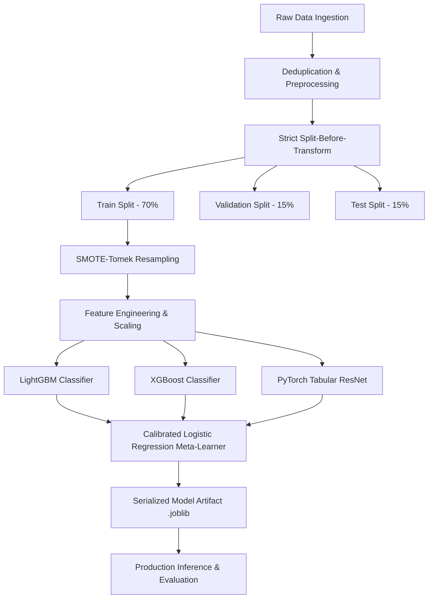

# 🛡️ Enterprise-Grade Credit Card Fraud Analytics & MLOps Pipeline

[](https://github.com/AhmedAtefYoussef/Fraud-Analytics-pipeline/actions/workflows/mlops-pipeline.yml)
[](https://python.org)
[](https://github.com/psf/black)
[](http://mypy-lang.org/)
[](https://github.com/AhmedAtefYoussef/Fraud-Analytics-pipeline/pkgs/container/fraud-pipeline)

An end-to-end, production-grade Machine Learning and MLOps Pipeline designed for high-precision credit card fraud detection on extremely imbalanced datasets. This repository showcases advanced ensemble modeling, rigorous anti-leakage engineering, comprehensive static analysis, containerized orchestration, and automated CI/CD deployment.

---

## 📖 Table of Contents

1. [Architectural Overview](#-architectural-overview)
2. [Key Engineering Standards](#%EF%B8%8F-key-engineering-standards)
3. [Repository Structure](#-repository-structure)
4. [Performance Metrics](#-performance-metrics)
5. [Installation & Local Setup](#-installation--local-setup)
6. [Pipeline Execution Sequence](#-pipeline-execution-sequence)
7. [Testing & Quality Assurance](#-testing--quality-assurance)
8. [Dockerization & Production Deployment](#-dockerization--production-deployment)
9. [Automated CI/CD Workflows](#-automated-cicd-workflows)

---

## 🏗️ Architectural Overview

The core modeling engine implements a **Stacking Ensemble Classifier** utilizing three diverse, optimized base learners and a calibrated meta-learner to maximize the trade-off between fraud capture (recall) and false alarm rates (precision).



### Base Models
* **LightGBM Classifier**: Gradient boosted decision tree optimized for high-speed, categorical split tracking.
* **XGBoost Classifier**: Robust gradient boosting framework utilized to capture complex non-linear feature interactions.
* **PyTorch Tabular ResNet**: Custom deep learning architecture incorporating residual skip connections, batch normalization, and dropout layers tailored for structured tabular data.

### Ensembling & Calibration
* **Meta-Learner**: Predictions from the base models are stacked and fed into a **calibrated Logistic Regression** classifier. This translates raw distance-based scores into reliable, calibrated probability estimates.
* **Optuna Optimization**: Hyperparameters are optimized via a multi-objective Tree-structured Parzen Estimator (TPE) study, jointly maximizing the Precision-Recall Area Under the Curve (PR-AUC) while minimizing inference latency constraints.

---

## 🛠️ Key Engineering Standards

* **Strict Anti-Leakage Guardrails**: The pipeline enforces a absolute boundary between the training partition and validation/test sets. Deduplication and splitting are completed *prior* to scaling, feature engineering, dimensional reduction, or oversampling. This ensures zero data leakage and represents a true out-of-sample performance evaluation.
* **Imbalance Mitigation**: The extreme class imbalance (0.172% fraud) is handled by fitting a synthetic oversampling and cleaning pipeline (**SMOTE-Tomek**) *exclusively on the training split*, preserving the natural distribution of the validation and test splits.
* **Explainability (SHAP & LIME)**: Includes global feature impact profiles via Tree SHAP summary models and local instance-level transaction analysis via LIME to satisfy auditability and compliance requirements.

---

## 📂 Repository Structure

```text
├── .github/
│   └── workflows/
│       └── mlops-pipeline.yml     # Automated CI/CD (Test, Lint, Typecheck, Docker Build/Push)
├── config/
│   └── config.yaml                # Master configuration file (parameters, paths, hyperparams)
├── data/                          # Data directory (Git-ignored except structure)
│   ├── raw/
│   ├── processed/
│   └── external/
├── models/                        # Serialized training models (Git-ignored)
│   └── final_stacked_ensemble.joblib
├── reports/
│   └── figures/                   # Production report assets and visualizations
│       ├── confusion_matrix.png   # Model evaluation confusion matrix
│       └── shap_summary.png       # Global feature importance summary (SHAP)
├── src/                           # Source directory containing pipeline stages
│   ├── __init__.py
│   ├── data/
│   │   ├── ingest.py              # Phase 1: Ingests raw data from HuggingFace/Kaggle
│   │   └── preprocess.py          # Phase 2: Performs split-before-transform partitioning
│   ├── features/
│   │   └── build_features.py      # Phase 3: Out-of-fold encoding, PCA, and SMOTE-Tomek scaling
│   ├── models/
│   │   ├── train_model.py         # Phase 4: Base training, Optuna tuning, and stacking
│   │   ├── evaluate.py            # Phase 5: Leakage audit, metric calculations, and report generation
│   │   └── predict_model.py       # Production-ready batch & stream inference module
│   └── utils/
│       └── logger.py              # Centralized logging controller
├── tests/                         # Full PyTest suite
│   ├── test_data.py
│   ├── test_features.py
│   └── test_models.py
├── Dockerfile                     # Multi-stage production container configuration
├── docker-compose.yml             # Local multi-volume container orchestrator
├── pyproject.toml                 # Standard packaging and build configuration
└── requirements.txt               # Declared system dependencies
```

---

## 📊 Performance Metrics

*Evaluated on the raw, un-sampled held-out test split (42,559 transactions, 71 fraud cases):*

| Metric | Score | Key Takeaway |
| :--- | :--- | :--- |
| **ROC-AUC** | `0.96109` | Superb discrimination capability under full range of classification thresholds. |
| **PR-AUC** | `0.80623` | Exceptionally high performance on highly imbalanced targets. |
| **Precision** | `91.38%` | Minimizes false alarms, ensuring 9 out of 10 flagged transactions are true fraud. |
| **F-beta (F2)** | `0.77485` | Heavily weights recall to catch maximum fraud without creating service disruption. |
| **Brier Score** | `0.00049` | Outstanding probability calibration (crucial for pricing transaction risk). |
| **Cohen's Kappa** | `0.82144` | High agreement rate accounting for random classification success. |

---

## 💻 Installation & Local Setup

### System Prerequisites
* Python 3.10+
* Git
* Optional: Docker Desktop (for containerized execution)

### 1. Clone & Initialize Environment
```bash
git clone https://github.com/AhmedAtefYoussef/Fraud-Analytics-pipeline.git
cd Fraud-Analytics-pipeline
```

### 2. Install Project Dependencies
Use pip to install packages directly into your environment:
```bash
pip install -r requirements.txt
```

### 3. Configure Pipeline Behavior
Pipeline hyperparameters, splitting ratios, and feature configurations are stored in `config/config.yaml`. Update this file to tweak model behavior.

---

## 🔁 Pipeline Execution Sequence

Execute each phase sequentially using python modules to replicate the full pipeline:

### Phase 1: Ingestion
Downloads the European cardholder transaction dataset from HuggingFace (falling back to Kaggle API if credentials are provided):
```bash
python -m src.data.ingest
```

### Phase 2: Partitioning & Basic Processing
Executes the split-before-transform operation to isolate training, validation, and test datasets:
```bash
python -m src.data.preprocess
```

### Phase 3: Feature Engineering & Balancing
Computes Target Encoding, PCA components, and fits SMOTE-Tomek to the training split:
```bash
python -m src.features.build_features
```

### Phase 4: Stacking Ensemble Training
Runs the hyperparameter optimization using Optuna and trains the stacked model:
```bash
python -m src.models.train_model
```

### Phase 5: Leakage Auditing & Evaluation
Performs split integrity checks, evaluates test performance, and writes visualization reports under `reports/figures/`:
```bash
python -m src.models.evaluate
```

---

## 🧪 Testing & Quality Assurance

The codebase enforces strict type safety, formatting standards, and verification tests. You can run the testing suite locally:

```bash
# Check code formatting (Black)
black --check src/ tests/

# Code style linting (Flake8)
flake8 src/ tests/ --count --max-line-length=127 --statistics

# Static typing assertion (MyPy)
mypy src/ --ignore-missing-imports --explicit-package-bases

# Execute all PyTest unit tests
python -m pytest tests/ -v
```

---

## 🐳 Dockerization & Production Deployment

The project features a containerized architecture allowing execution anywhere without installing dependencies on the host system.

### Build the Image Manually
```bash
docker build -t fraud-pipeline:latest .
```

### Orchestrate with Docker Compose
We map volumes to seamlessly persist data, serialized models, execution logs, and generated visualizations back to your host machine:
```bash
docker-compose up --build
```

---

## 🔄 Automated CI/CD Workflows

A GitHub Actions pipeline is integrated into the repository to guarantee continuous build security. On every push and pull request to the `main` branch, the pipeline executes the following checks in a clean Linux environment:
1. **Linting & Style Checks**: Black (formatting assertion) and Flake8 (syntax verification).
2. **Type Security**: MyPy assertions.
3. **Unit Tests**: Complete PyTest execution.
4. **Automated Docker Ship**: If all test suites pass, the pipeline builds the production Docker container and pushes it to the **GitHub Container Registry (GHCR)** at `ghcr.io/ahmedatefyoussef/fraud-analytics-pipeline/fraud-pipeline:latest`.

---
*Created and maintained by Ahmed Atef Youssef. Ready for enterprise-grade deployment.*
